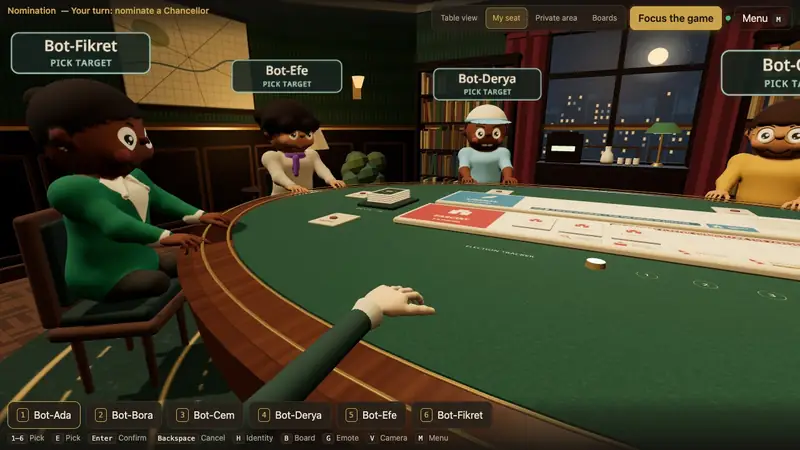
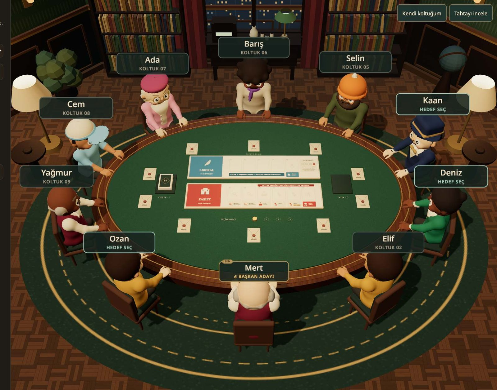
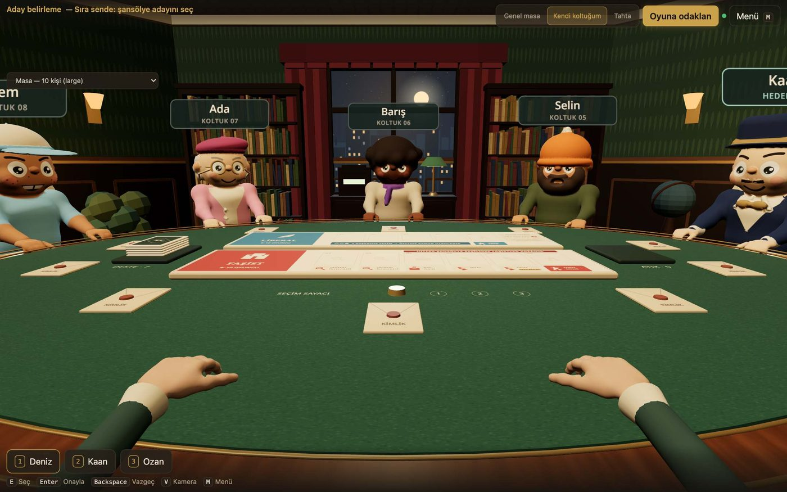
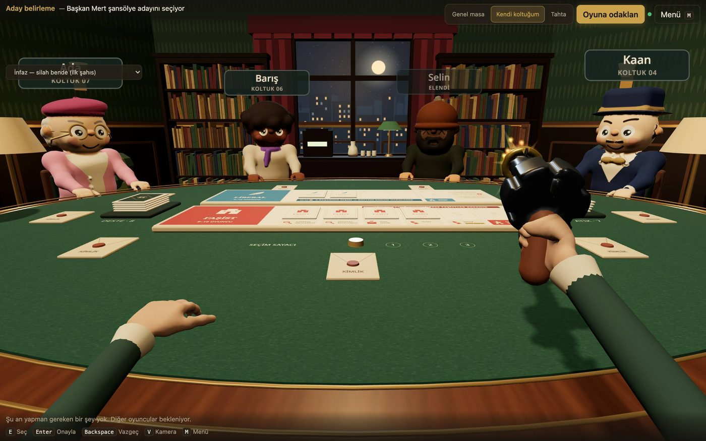
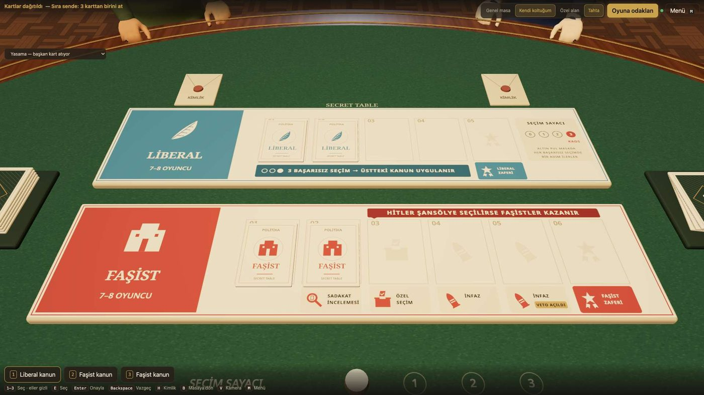
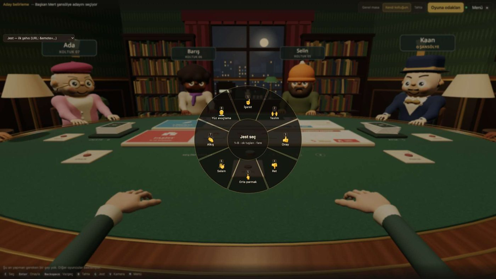
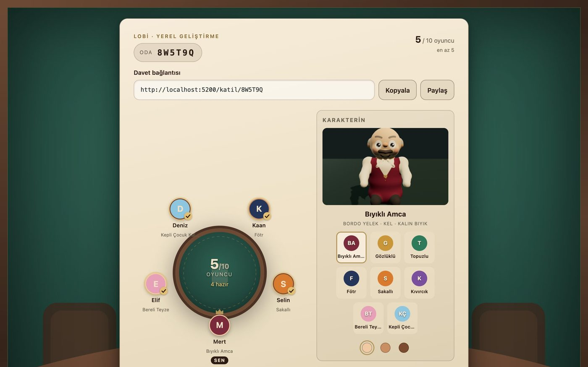
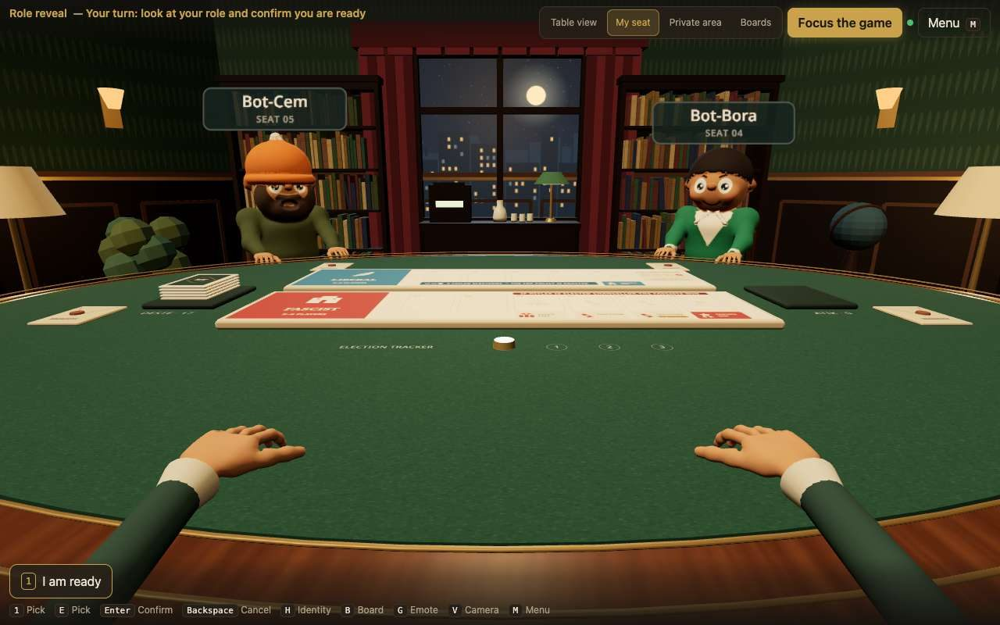

<h1 align="center">Secret Table</h1>

<p align="center">
  A 3D social-deduction game for 5–10 friends, played in the browser at a shared virtual table.<br/>
  Based on the rules of <em>Secret Hitler</em> · first-person view · hand gestures · Turkish and English UI · no accounts, no install.
</p>

<p align="center">
  <a href="LICENSE"></a>
  
  
  
  
</p>

<p align="center">
  
</p>

**Secret Table** puts your group around one table in a 1930s back room. Everyone sits in
a chair, looks around in first person, points, waves and claps with real hands, and plays
the full ruleset of *Secret Hitler*: elections, legislative sessions, the election
tracker, presidential powers, veto, and the two ways each side can win.

The game runs on serverless functions and a Postgres database, so there is nothing to
keep alive and the free tiers of Vercel and Supabase are enough for a friend group.
Hidden roles, the deck order and private hands never leave the server.

## Play

**The recommended way is to run your own copy.** This is a small project that fits in
the free tiers: create a Supabase project, apply the migrations, deploy to Vercel, and
you have a private table for your own group with no shared quota and no one else's
rooms next to yours. It takes a few minutes and every step is written out in
[`docs/SETUP.md`](docs/SETUP.md).

There is also a preview deployment, kept only so you can see the game before setting
anything up: **[open the preview](https://secret-table-game-web.vercel.app/)**

If you open it on your own, press **Try it solo**: a full table with five bots is dealt
straight away and the whole game runs in your browser — no account, no server, nothing saved.

> The preview runs on the smallest free tiers. It can reach its hourly guest limit or
> slow down when several groups open it at the same time. That is a limit of the demo,
> not of the game, and it is not meant for a real game night. Host your own copy for
> that; it is the same code.

## Features

- **A real table, not a lobby.** Round table, eight parametric characters with three skin
  tones, name plates, envelopes, policy cards and both boards, all generated in code.
- **First person.** Turn your head, look at your neighbours, lean over the boards (`B`),
  and hold your own cards in your hands. Other players see your head move.
- **Hand gestures.** A radial wheel (`G`) with eight emotes: point, hands up, thumbs up
  and down, wave, clap, facepalm and one more. Your hands follow where you look and
  everyone at the table sees them.
- **Executions with a revolver.** When the President gains the execution power a gun
  appears in their hand; the shot, muzzle flash and the victim slumping are played for
  everyone.
- **Every rule, every player count.** 5–10 players, all three board layouts,
  Investigate Loyalty, Special Election, Policy Peek, Execution, veto power, Hitler
  knows the fascist at 5–6, chaos on three failed elections, and so on.
- **Two languages per player.** The interface opens in English; Turkish is one click
  away on the entry screen or in the menu, and the choice is remembered. Language is a
  personal setting, not a room setting: two people at the same table each see the
  boards, the cards and the HUD in their own language.
- **No accounts.** The host shares an invite link; guests pick a name and a character.
- **Server-authoritative.** The client only sends move requests. Every player gets a
  filtered view; a deterministic, seeded engine makes every game replayable in tests.
- **Bots and dev scenarios** for local testing (jump straight to an execution, a veto
  round, a Hitler-zone round…), off in production builds.

## Screenshots

<p align="center">
  
</p>

| First person at a 10-player table | The President executes a player |
|---|---|
|  |  |

| Leaning over the boards | The gesture wheel |
|---|---|
|  |  |

| Lobby with character picker | English UI at the same table |
|---|---|
|  |  |

## How it works

```
apps/web            React + Vite + react-three-fiber client, Vercel functions in api/
packages/contracts  Shared types, Zod schemas, rule tables (board layouts, role setups)
packages/game-core  Pure, deterministic rules engine: createGame() + applyCommand()
packages/server     Command service, per-player projection, Supabase / in-memory gateways
packages/scene      The 3D table: room, characters, hands, cards, boards, animations, audio
packages/fixtures   Scene fixtures for the dev pages and tests
supabase/           Postgres schema, RLS, RPCs, Realtime triggers (migrations)
```

1. A player sends a **command** (`nominate`, `vote`, `discard`, `use_power`…) over HTTP.
2. The server loads the game row, runs the engine, and commits the new state with a
   compare-and-swap on the revision, so a move can never be applied twice.
3. A database trigger publishes only a **revision number** on a private Supabase
   Realtime channel. Clients that hear it fetch their own filtered **view** over HTTP.
4. Head direction and gestures travel on a low-rate broadcast channel; the receiver
   buffers and interpolates them so heads move smoothly even at one packet per second.

The long version — dependency direction, the seeded deterministic engine, per-player
projection, the SDF → marching cubes → skinned mesh pipeline and the interpolation of
the live look channel — is in [`docs/ARCHITECTURE.md`](docs/ARCHITECTURE.md).

## Run it locally

Requirements: Node.js 20+ and pnpm 9+. Without any environment variables the app runs
in an **in-memory mode**: open several browser tabs (or add bots from the lobby) and play
a full game on your machine.

```bash
pnpm install
pnpm --filter @secret-table/web dev
```

```bash
pnpm -r typecheck && pnpm test && pnpm --filter @secret-table/web build
```

Dev pages: `/dev/scene` (every scene fixture), `/dev/hands` (hand rig), `/dev/game`.

## Host your own (recommended)

1. Create a Supabase project, enable **anonymous sign-ins**, and apply
   `supabase/migrations/` in order.
2. Copy `.env.example` to `.env` and fill in the Supabase URL, publishable key and the
   server-side keys. Nothing else is required.
3. Deploy `apps/web` on Vercel (framework: Vite; the `api/` folder becomes functions)
   with the same variables.

Everything stays inside the free tiers of both services for a group of friends, and
neither plan bills you automatically if you go over: they throttle instead.

The step-by-step guide, the security model (explicit grants, RLS, private Realtime
channels), the free-tier maths and troubleshooting are in
[`docs/SETUP.md`](docs/SETUP.md). The original Turkish document, with the full
deployment history, is [`docs/DEPLOYMENT.md`](docs/DEPLOYMENT.md) (Turkish).

## Status

Playable end to end with 5–10 players. Verified with simulated games (1 800 seeded
games checked against the rulebook invariants), 1 024 unit and integration tests, and
live sessions. Open items are tracked in the Turkish working log,
[`docs/ROADMAP.md`](docs/ROADMAP.md); [`docs/README.md`](docs/README.md) says which
documents are English and which are Turkish notes.

## Contributing

Build commands, package boundaries and what a pull request should contain are in
[`CONTRIBUTING.md`](CONTRIBUTING.md). Code comments are in Turkish; user-facing text
lives in the i18n tables and must be added in both languages.

## Licence and attribution

This repository is released under **[CC BY-NC-SA 4.0](LICENSE)**, for
**non-commercial** use.

*Secret Hitler* was created by Mike Boxleiter, Tommy Maranges, Max Temkin and Mac
Schubert and is © Goat, Wolf & Cabbage LLC, published under CC BY-NC-SA 4.0. This
project is an **unofficial fan implementation of its rules**, adapted to a 3D
multiplayer format. It is **not affiliated with, endorsed by or connected to** the
authors or publisher. The name *Secret Hitler* is used only to identify the ruleset;
the product is called Secret Table. The official logo, card, board and box artwork are
**not** used: every model, texture, icon and sound here is generated in code for this
project, and the fonts are Noto Sans / Noto Serif under the SIL Open Font License.
Details and third-party notices: [`NOTICE.md`](NOTICE.md), asset inventory:
[`docs/ASSETS.md`](docs/ASSETS.md).

---

## Türkçe

**Secret Table**, 5–10 arkadaşın tarayıcıdan aynı sanal masaya oturduğu, *Secret
Hitler* kurallarına dayanan 3D bir gizli rol oyunudur. Hesap ve kurulum yok: ev sahibi
davet bağlantısını paylaşır, gelenler isim ve karakter seçip masaya oturur. Birinci
şahıs bakış, el jestleri, tabancalı infaz sahnesi, 5–10 kişilik bütün kurallar ve
oyuncu başına seçilen **Türkçe / İngilizce** arayüz (varsayılan İngilizce, TR/EN anahtarıyla değişir).

Oynamanın **önerilen yolu kendi kopyanı çalıştırmak**: Supabase projesi aç,
migration'ları uygula, Vercel'e dağıt. Birkaç dakika sürer, ikisinin de ücretsiz
katmanı bir arkadaş grubuna yeter ve sınırı aşarsan fatura kesilmez, yavaşlatılır.
Böylece masa tamamen size ait olur. Adımlar: [`docs/SETUP.md`](docs/SETUP.md)
(İngilizce) ve [`docs/DEPLOYMENT.md`](docs/DEPLOYMENT.md).

Depodaki ön izleme linki yalnızca **kurulum yapmadan oyunu görebilmek** içindir. En
küçük ücretsiz katmanda çalışır; aynı anda birkaç grup açtığında saatlik misafir
sınırına takılabilir veya yavaşlar. Bu demonun sınırıdır, oyunun değil. Gerçek bir
oyun gecesi için kendi kopyanızı çalıştırın, kod aynıdır.

Yerelde denemek için `pnpm install && pnpm --filter @secret-table/web dev`
(ortam değişkeni olmadan bellek kipinde çalışır). Geliştirme notları
[`docs/GELISTIRME.md`](docs/GELISTIRME.md), yol haritası [`docs/ROADMAP.md`](docs/ROADMAP.md).

Bu depo **CC BY-NC-SA 4.0** ile, **ticari olmayan** kullanım için yayımlanır. Secret
Hitler © Goat, Wolf & Cabbage LLC, aynı lisansla; bu proje resmî olmayan bir hayran
uygulamasıdır, yapımcılarla bir bağı yoktur. Resmî ad (ürün adı olarak), logo ve
kart/tahta görselleri kullanılmadı; bütün varlıklar bu proje için kodda üretildi.
Ayrıntı: [`NOTICE.md`](NOTICE.md).
