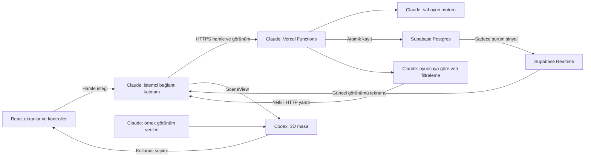

# Ayrıntılı uygulama planı

## Son kapsam güncellemesi — tam ekran ve fareyle bakış

[FINISH_PLAN.md](FINISH_PLAN.md) son uygulama sırası için esas alınır: mevcut kritik QA düzeltmelerinden sonra kamera/eller ve doğrulanmış baş yönü paylaşımı canlı oyuna bağlanacak; masaüstünde isteğe bağlı Fullscreen + Pointer Lock eklenecek. Gerçek arkadaş grubu kabulü açık kalır ancak bağımsız geliştirmeyi bekletmez. Son geliştirme ve yerel kontrollerden sonra Vercel test yayını yetkilidir; gerçek cihaz/arkadaş grubu kabulü yayın adresinde yapılır (FINISH_PLAN §7, COORD-005). Aşağıdaki önceki F00 bekleme ve zorunlu pointer lock olmayan başlangıç kapsamı, bu isteğe bağlı mod için güncellenmiştir.


Hazırlanma: 2026-09-09; aynı gün kullanıcı düzeltmesiyle Vercel + Supabase mimarisine güncellendi. Proje konumu `Development/bireysel/secret-table`. Uygulama geliştirmesi sürüyor. Bu belge iş kapsamını tanımlar; güncel tamamlanma ve doğrulama bilgisi ajan durum dosyalarındadır.

## Kullanıcı ek aşaması — 2026-09-09

Çalışan oyun C06/J01 ile doğrulandıktan sonra **koltuktan birinci şahıs kamera, paylaşılan baş yönü ve el/kart etkileşimleri** geliştirilecek. Başlama koşulu, F00–F05 görevleri, Codex/Claude sahipliği ve kabul kontrolleri [FIRST_PERSON_PLAN.md](FIRST_PERSON_PLAN.md) içinde. Şimdilik yalnız planlandı; mevcut 0.2.0 sözleşmesi ve kod değişmedi. Yeni aşama son X04 cilasından önce gelir.

## Kullanıcı kararı — 2026-09-10 (C06 → J01 sırası)

- **Vercel kurulumu/deployu, uygulama tamamlanana kadar ERTELENDİ.** C06'nın uzak
  Supabase migration/ayar kısmı yapıldı ve doğrulandı (`docs/qa/claude/C06.md`);
  Vercel adımı ayrı ve sonraya bırakıldı.
- **Sıradaki iş (J01 hazırlığı):** yerelde çalışan uygulama + gerçek uzak Supabase ile
  **6 ve 7 bağımsız oturumda `game_over`'a kadar** tam oyun; yeniden bağlanma; animasyon
  zamanlaması kontrolleri (CODEX-009). Aynı kimliği paylaşan sekmeler yeterli değildir
  (FIRST_PERSON_PLAN F00 ile aynı ölçüt).
- **Otomatik testler ile gerçek arkadaş grubu testleri AYRI raporlanır.** Script/bot ile
  yapılan uçtan uca akış bir kanıttır; gerçek insan oyun gecesi (J01) ayrı ve zorunludur.
- **Birinci şahıs kamera/el/bakış aşaması (F01–F05), `FIRST_PERSON_PLAN.md` F00 kabulünden
  SONRA** başlar. F00 kanıtı olmadan yeni aşama açılmaz.

## 1. Ürün hedefi

Bir kişi oda açar, bağlantıyı arkadaşlarına gönderir. Katılanlar isim yazarak masada yer alır. Oyun, kişiye özel roller ve kartlarla tarayıcıda yürür. Sunucu kuralları uygular; oyuncular konuşmayı Discord üzerinden yapar. İlk başarı ölçütü, 6 ve 7 kişinin kurulumsuz bağlanarak birer tam oyun bitirmesidir.

### İlk oynanabilir sürüme dahil

- 5–10 oyuncu; başlangıçtaki oyuncu sayısına göre kurallar ve masa yerleşimi.
- Türkçe arayüz, isimle katılım, paylaşılabilir oda bağlantısı ve kopyalama düğmesi.
- Oda sahibi, hazır olma durumu, oyunu başlatma ve oyun sonu yeniden oynama.
- Gerçek 3D ortam/harita, stilize karakter/avatarlar, masa, koltuklar, isimlikler, kapalı/açık kartlar, rol zarfı, oyun tahtaları ve görev işaretleri.
- Rolünü özel olarak açma, aday seçme, oy verme, kart seçme ve özel yetki ekranları.
- Kuralları eksiksiz uygulayan oyun motoru; oyuncunun yapamayacağı hamlelerin sunucuda reddi.
- Herkese açık tur geçmişi, bağlantı durumları, hata ve yükleme ekranları.
- Aynı tarayıcıdan bağlantı kopması / sayfa yenilemesi sonrası aynı oyuncu olarak dönme.
- Ses kapatma, düşük grafik seçeneği, azaltılmış hareket ve klavye ile temel kontroller.
- Masaüstü tarayıcıda öncelikli deneyim; küçük ekran için kullanılabilir yatay düzen.

### Sonraki sürümlere bırakılanlar

E-posta/şifreyle hesap açma ekranları, arkadaş listeleri, sıralama, eşleştirme, uygulama içi ses/video, sohbet moderasyonu, yapay zekâ oyuncuları, serbest karakter dolaşımı, fizik tabanlı sürükleme, farklı oyunlar, tema mağazası ve ayrıntılı dikey telefon deneyimi. Arka plandaki misafir kimliği ve oyun durumunu kalıcı saklama ilk sürüme dahildir.

## 2. Açıkça belirlenmiş varsayımlar

| Konu | Başlangıç kararı |
| --- | --- |
| Kullanım | Arkadaş grubu, bağlantıyı bilenlerin katıldığı listelenmeyen odalar |
| Oyuncu aralığı | 5–10; ilk gerçek testler 6 ve 7 |
| Oyuncu sayısı değişimi | Lobide serbest; oyun başladıktan sonra yeni oyuncu alınmaz |
| Görsel yön | Ceviz masa, koyu yeşil keçe, sıcak ışık, krem kartlar, pirinç detaylar |
| Kamera | İlk sürüm eğimli masa görünümü; çalışan oyun sonrası F02 ile isteğe bağlı göz hizası ve sınırlı baş dönüşü |
| Dil | Türkçe; metinler bir sözlükte toplanır |
| Sesli görüşme | Harici Discord görüşmesi |
| Hamle işleme | Vercel Functions üzerinde kısa HTTP istekleri, TypeScript oyun motoru |
| Veritabanı | Supabase Postgres; ilk sürümden itibaren oyun durumunun kalıcı kaynağı |
| Kimlik / anlık iletişim | Supabase Anonymous Auth / özel Realtime kanalları |
| Yayın sağlayıcısı | Vercel; ayrı sürekli çalışan oyun sunucusu planlanmıyor |

Görsel yön kullanıcı geri bildirimine açık bir başlangıç kararıdır. Marka/son isim ve telefon cilası ilk çalışan oyunu engellemez.

## 3. Oyun akışı ve ekranlar

1. **Giriş:** İsim yaz, oda aç veya bağlantıdaki odaya katıl. Geçersiz/kapalı/dolu oda için anlaşılır mesaj.
2. **Lobi:** Masadaki yerini, katılanları ve hazır olanları gör. Oda sahibi yeterli oyuncu ve hazır durumu ile başlatır.
3. **Rol tanışması:** Yerel rol zarfını aç; sunucunun izin verdiği başlangıç bilgisini gör; hazır olduğunu bildir.
4. **Adaylık ve görüşme:** Başkan adayı ve seçilebilecek oyuncular vurgulanır. Kullanıcı seçimi ayrı bir onayla kesinleştirir.
5. **Oylama:** Oy seçimi özel kalır. Gönderenlerin hazır durumu görünür; sonuçlar birlikte açılır.
6. **Yasama:** İlgili oyuncunun kartları özel alanda görünür; diğerleri yalnızca sürecin devam ettiğini görür.
7. **Sonuç / yetki:** Tahtaya kart yerleşir; gerekli özel işlem tamamlanır; sonraki tura geçilir.
8. **Oyun sonu:** Kazanan ve nedeni açıklanır; bu aşamada roller açılabilir; yeniden oynamak için lobiye dönülür.
9. **Bağlantı kesilmesi:** İşlem düğmeleri durur, yeniden bağlanma bilgisi görünür; durum geri geldiğinde doğrudan doğru sahneye dönülür.

Kuralların kaynağı [resmî kural kitapçığıdır](https://www.secrethitler.com/assets/Secret_Hitler_Rules.pdf). Claude C02'de oyunun tüm ayrıntılarını bu kaynaktan doğrular. Bu belge alternatif veya sadeleştirilmiş bir kural seti tanımlamaz.

## 4. Mimari



### Paket tercihleri

| Alan | Tercih | Gerekçe / sınır |
| --- | --- | --- |
| Ortak dil | TypeScript, strict | Sözleşme hatalarını geliştirmede yakalamak |
| Web | React + Vite | Lobi, kontroller ve geliştirme sahnesi |
| 3D | Three.js + React Three Fiber + Drei | React içinde gerçek 3D sahne ve yardımcı nesneler |
| Sunucu | Vercel Functions, Node.js çalışma ortamı | Kimliği doğrulanmış kısa HTTP hamleleri ve görünüm API'si |
| Kalıcı veri | Supabase Postgres + SQL migration/RPC | Oda durumu, atomik hamle kaydı ve eşzamanlılık |
| Kimlik | Supabase Anonymous Auth | Kullanıcıya kayıt ekranı göstermeden koltuğa geri dönüş |
| Anlık iletişim | Supabase Realtime Broadcast | Özel oda kanalında yalnız yeni sürüm bildirimi; gizli veriler HTTP'den |
| Oyun motoru | Bağımsız TypeScript paketi | Ağ veya tarayıcı olmadan kuralları test etmek |
| Girdi doğrulama | Zod veya eşdeğer tek şema kütüphanesi | Ağdan gelen mesajları çalışma anında doğrulamak; C00'da Claude seçer |
| Çalışma alanı | pnpm workspace | Bir kilit dosyası, açık paket sınırları |
| Test | Vitest; Playwright ile tarayıcı akışları | Kurallar ve çoklu oyuncu oturumlarını doğrulamak |
| Görseller | Önce kodla geometri, özgün SVG/Canvas kart yüzleri; gerektiğinde GLB | Düzenlenebilir nesneler ve küçük dosyalar |
| Stil | CSS ve ortak tasarım değişkenleri | Küçük uygulama için ek UI çatısı gerektirmemek |

Sürümler bu plan tarafından sabitlenmez. C00'da Vercel Node çalışma ortamı, React/R3F/Three ve Supabase istemci uyumu kontrol edilir; kesin sürümler manifestlerde ve kilit dosyasında kaydedilir. Sahne animasyonları ilk etapta mevcut Three/R3F olanaklarıyla yazılır; GSAP, fizik motoru veya başka animasyon bağımlılığı varsayılan değildir.

Teknik dayanaklar: [Vite](https://vite.dev/guide/), [React Three Fiber](https://r3f.docs.pmnd.rs/getting-started/introduction), [Drei](https://drei.docs.pmnd.rs/), [Vercel Functions](https://vercel.com/docs/functions/quickstart), [Supabase Realtime](https://supabase.com/docs/guides/realtime/broadcast). Yayın ve veritabanı ayrıntıları [DEPLOYMENT.md](DEPLOYMENT.md) içindedir. Bu mimari projeye özel bir tercihtir.

### Planlanan klasörler

```text
secret-table/
  AGENTS.md                       Codex giriş yönergeleri
  CLAUDE.md                       Claude giriş yönergeleri
  apps/
    web/src/
      app/                        Sayfalar, yönlendirme, yükleme/hata ekranları
      multiplayer/                Bağlantı, kimlik ve yeniden bağlanma
      adapters/                   Yetkili veriyi SceneView'e dönüştürme
      ui/                         HTML kontroller, rol paneli, erişilebilirlik
      dev/                        Yalnızca geliştirmede /dev/scene
    web/api/                      Vercel HTTP girişleri; oyun motoru burada içe aktarılır
  packages/
    server/src/                   Yalnız sunucu: kimlik, odalar, görünüm filtreleme, DB ve komutlar
    contracts/src/                DTO'lar, SceneView, SceneIntent ve protokol
    game-core/src/                Kurallar, durum geçişleri, sunucu içi bilgiler
    fixtures/src/                 Yalnızca sentetik örnekler
    scene/src/
      objects/                    Masa, kart, tahta, isimlik, görev işaretleri
      materials/                  Renkler, yüzeyler, kart dokuları
      layout/                     5–10 koltuk ve kamera yerleşimi
      animation/                  Görsel olaylar ve geçişler
      dev/                        Tek nesne / bileşen örnekleri
      TableScene.tsx              Sahnenin dışa açılan bileşeni
    scene/public/                 Özgün doku, model, font ve ses dosyaları
  supabase/
    migrations/                   Tablolar, RLS, atomik kayıt işlevleri, Realtime tetikleyicileri
    tests/                        DB izinleri ve eşzamanlılık kontrolleri
  tests/                          Entegrasyon ve çoklu tarayıcı testleri
  docs/                           Plan, sözleşme ve koordinasyon
```

`apps`, `packages`, `supabase` ve `tests` bu aşamada yalnızca planlanan yollardır. C00 oluşturacak. `game-core` ve `server` tarayıcı derlemesine dahil edilmez; yalnız Vercel API bunları içe aktarır. Sentetik örnekler ve geliştirme araçları üretim oyununa dahil edilmez.

## 5. Veri ve bağlantı kararları

- Sunucu tek otoritedir. İstemci `oy=evet`, `hedef=oyuncuKimliği` gibi istek gönderir; sonuç, rol veya deste düzeni gönderemez.
- Her oyuncu HTTP API'den açıkça izin verilen alanlarla oluşturulmuş **tam yetkili oyuncu görünümü** alır. Supabase Realtime yalnız oda kimliği/sürüm değişikliği bildirir; her karede durum gönderilmez.
- Tam gizli oyun durumu Supabase'te yalnız sunucuya açık tutulur. İstemci bu tabloya erişemez; `...internalState` gibi kopyalama yapılmaz. RLS ve DB ayrıcalıkları test edilir.
- Her görünüm `gameId`, `revision` ve `phaseId` taşır. Eski oyun veya eski aşamaya ait istekler reddedilir. Aynı oylama aşamasındaki bağımsız oylar, başka oyuncu oy verdi diye geçersiz sayılmaz.
- Her hamlede `commandId` bulunur. Tekrarlanan istek aynı etkiyi ikinci kez oluşturmaz. Durum, komut kaydı ve sürüm bildirimi aynı DB işlemiyle kesinleşir; eşzamanlı hamlelerde sürüm kontrolü ve sınırlı yeniden deneme vardır.
- Herkese açık olaylarla özel olaylar alıcı bazında ayrılır. Geçmiş, log, hata mesajı ve görsel olaylar da aynı veri filtresinden geçer.
- Davet kodu oyuncu kimliği değildir. Supabase misafir oturumu doğrulanır ve kullanıcı kimliği koltuğa bağlanır. Aynı tarayıcı oturumu yenilemede geri döner; isim yazarak koltuk devralınamaz. Tarayıcı oturum verileri silinirse otomatik kimlik kurtarma ilk sürüm kapsamında değildir.
- Önerilen geri dönüş süresi: 10 dakika. Bağlantısı kesilen oyuncunun koltuğu ve rolü korunur. Katılımcı sayısı değişmez; rastgele oy/hamle üretilmez.
- Gerekli bir oyuncu çevrimdışıysa oyun duraklatılır. Süre dolduğunda oda sahibi oyunu iptal edip lobiye dönebilir; başka oyuncuya gizli rol devredilmez. Oyun terk edilmeden devam edebilme penceresinin kesin uygulaması C03'te kaydedilir.
- Bağlılık ve oda sahipliği sunucuda kaydedilen oturum/son görülme bilgisiyle değerlendirilir. İstemci Presence mesajı tek başına oyun yetkisi vermez. Oda sahibi kaybolursa süre kontrolü yapan işlem bağlı bir oyuncuya yönetimi devreder; oda sahipliği gizli verilere erişim sağlamaz.
- Başlamış oyuna yeni oyuncu veya yeni seyirci alınmaz. Elenen oyuncu kendi bağlantısıyla genel masayı izleyebilir, yeni gizli bilgi alamaz.
- Oda süreleri DB'de zaman damgasıyla tutulur. Süresi dolmuş oda ilk erişimde kapalı kabul edilir; fiziksel temizlik isteğe bağlı zamanlanmış iş veya bakım komutuyla yapılır. Tüm oyuncuların koptuğu oda geri dönüş süresi boyunca korunur. Function örneği değişmesi kayıtlı oyunu silmez.
- Realtime bildirimi kaçarsa yeniden abonelik ve kısa aralıklı yedek HTTP kontrolü son görünümü getirir. API yanıtları oyuncuya özeldir ve önbelleğe alınmaz. Supabase kesintisinde başarı gösterilmez; aynı komut kimliğiyle güvenli tekrar denenir.

## 6. Görevler ve bağımlılıklar

Tahminler odaklı geliştirme emeğidir; AI çalışma hızına, araçlara ve görsel revizyonlara göre değişir. Token veya takvim garantisi değildir. Aynı anda yürüyebilen işlerin süreleri doğrudan toplanmaz.

| ID | Sorumlu | İş / teslim | Ön koşul | Kabul ölçütü | Tahmini emek |
| --- | --- | --- | --- | --- | --- |
| P00 | Codex | Plan, iş bölümü, MD protokolü | Yok | İki ajan görevlerini ve sınırlarını okuyabiliyor | Bu teslim |
| P01 | Codex | Kullanıcının konum düzeltmesi ve Vercel/Supabase planı | P00 | Proje bireysel altında; plan, sözleşme ve devirler yeni mimaride | Bu düzeltme |
| C00 | Claude | Workspace, Vercel API girişi, Supabase yerel ayarı, dev sahnesi | P00/P01 | Web/API geliştirme girişi ve migration yolu hazır; doğrulanmış komutlar README'de | 0,5–1 gün |
| C01 | Claude | Sözleşme tipleri, sentetik örnekler, başlangıç sahne taslağı | C00 | Örnekler tip kontrolünden geçiyor; sahne devri açık | 0,5–1 gün |
| X01 | Codex | Kamera, ışık, masa ve koltuk yerleşimi | C00, C01 taslağı | 5/6/7/8/9/10 kişi görünümü; masa ve isimlikler okunabilir | 0,5–1,5 gün |
| X02 | Codex | Karakter/avatarlar, kartlar, zarflar, tahtalar, isimlikler ve görev işaretleri | X01 | Nesneler örnek sahnede; ölçüler ve durumlar ASSETS'te | 1–2 gün |
| C02 | Claude | Saf oyun motoru ve kuralların testleri | C01 | Tüm aşamalar ve oyuncu sayıları; kritik kural testleri geçiyor | 1,5–3 gün |
| C03 | Claude | Supabase şema/RLS/RPC, misafir kimliği, Vercel API, Realtime ve geri dönüş | C02 | 7 ayrı istemci; gizlilik, eşzamanlı hamle, kalıcı kayıt ve geri dönüş testleri geçiyor | 2–3 gün |
| C04 | Claude | Giriş, lobi, HTML kontroller ve hata akışları | C01; canlı veri için C03 | Kullanıcı her oyun eylemine anlaşılır bir kontrolle ulaşabiliyor | 1–2 gün |
| X03 | Codex | Kart ve oy animasyonları, seçim vurguları, ses bağlama noktaları | X02, sabit sözleşme | Olaylar tek kez oynuyor; hareket azaltma ve kesinti destekli | 1–2 gün |
| C05 | Claude | 3D sahne ile canlı oyunun entegrasyonu | C03, C04, X02 | İstek → sunucu → görüntü döngüsü tüm aşamalarda çalışıyor | 1–2 gün |
| J01 | Claude lider, Codex görsel alan | İlk 6 ve 7 kişilik tam oyun | C05, X03 | Her iki oturumda oyun bitiyor; engeller sahibine atanmış | 0,5–1 gün |
| X04 | Codex | Eller, başlar ve yeni kamera dahil görsel düzeltme, düşük kalite ve ekran boyutu kontrolü | J01, F05 | QA performans hedefleri ölçülmüş; bozuk görünüm kalmamış | 0,5–1,5 gün |
| C06 | Claude | Uzak Supabase kurulumu/testi + ayrı Vercel dağıtım adımı | DB/test hazırlığı C05 sonrası; son yayın kabulü J01 | Migration, ortam değişkenleri, oda URL'si ve dış ağ testi | 0,5–1 gün |
| J02 | Claude lider, Codex görsel alan | Son kabul ve oyun gecesi kontrolü | X04, C06 | QA listesinin zorunlu maddeleri ve iki gerçek tam oyun | 0,5–1 gün |

Görev tablosundaki ajanlar varsayılan sorumlulardır. Kullanıcı herhangi bir işi Codex, Claude veya başka bir ajana aktarabilir; güncel atama ve dosya devri COORDINATION ile ilgili ajan durum dosyalarında tutulur.

### En verimli çalışma sırası

1. Claude C00/C01'i hazırlar. Codex bu sırada tasarım belgesini kullanıcı geri bildirimiyle netleştirebilir; aynı kurulum dosyalarını yazmaz.
2. Sahne sözleşmesi devredilince Codex X01/X02'yi, Claude C02/C03'ü yürütür.
3. Codex X03'e geçerken Claude C04/C05'i tamamlar. Önce bir adaylık–oylama–kart yerleştirme turu uçtan uca birleştirilir.
4. J01 ile gerçek kullanım sorunları bulunur; düzeltmeler dosya sahibine döner.
5. C06 uzak Supabase hazırlığı yapıldı (2026-09-10). **Vercel yayını uygulama tamamlanana
   kadar ertelendi.** Sıradaki iş yerel uygulama + gerçek uzak Supabase ile 6/7 bağımsız
   oturumlu `game_over` testi, yeniden bağlanma ve animasyon zamanlaması (bkz. üstteki
   "Kullanıcı kararı — 2026-09-10").
6. Çalışan oyun kanıtı F00 ile kaydedilince [F01–F05](FIRST_PERSON_PLAN.md) kamera/el/bakış aşaması yürütülür. F01 sonrası Codex görselleri ile Claude bağlantısı paralel ilerleyebilir.
7. Yeni özelliklerden sonra X04 cilası, C06 yayın adımı ve J02 son kabulü tamamlanır. İlk çalışan temel sürümün kabulü ile yeni özelliklerin kabulü ayrı raporlanır.

## 7. Vercel + Supabase yayın hazırlığı

Yayın hedefi kullanıcının seçtiği Vercel ve Supabase'tir. Vercel web dosyalarını ve kısa API işlemlerini çalıştırır; Supabase kalıcı oyun durumunu, misafir kimliğini ve Realtime kanallarını sağlar. Ayrı VPS veya Colyseus süreci kurulmaz. Bir Vercel deploy'u tek başına DB tablolarını kurmaz; migration ve Supabase ayarları C06 tesliminin parçasıdır.

Claude [DEPLOYMENT.md](DEPLOYMENT.md) doğrultusunda şu teslimleri hazırlar:

- Tekrarlanabilir kurulum, derleme, yerel API ve Supabase migration komutları.
- Gizli değer içermeyen `.env.example`; tarayıcıya açık publishable anahtar ile yalnız API'de kullanılan secret anahtarın ayrılması.
- Vercel proje kökü `apps/web`; ortak workspace paketlerini kapsayan derleme, API yollarını bozmayan SPA yönlendirmesi ve statik 3D varlık sunumu.
- Supabase Auth misafir girişleri, üyelik RLS kuralları, özel Realtime kanalları ve atomik DB kayıt işlevleri.
- Preview ile production verilerini ayırma; oyun durumu sürümüne uyumlu migration ve geri alma notu.
- Sağlık kontrolü, gizli veri içermeyen loglar, oda/istek üst sınırları.
- Başka internet bağlantısından katılım, yenileme, kaçan bildirim ve yeni Function örneğiyle devam testi.

Uzak Supabase projesi kullanıcı tarafından oluşturuldu ve bağlantı değerleri Git dışında yerel ortam dosyasına kaydedildi. Canlı migration/test ve Vercel dağıtımının güncel durumu Claude devir/QA belgelerinden doğrulanır; bu plan tamamlandıklarını varsaymaz. Güncel kota ve maliyetler yayın hazırlığında kontrol edilir; ücretsiz çalışma garantisi verilmez.

## 8. Bitti sayılması için

- 6 ve 7 kişi bağlantıdan başlayıp birer tam oyun bitirebiliyor.
- 5–10 oyuncu için otomatik kurallar ve bağlantı testleri geçiyor.
- Gizli bilgiler yetkisiz istemciye hiçbir veri kanalından gönderilmiyor.
- Yenileme sonrası rol ve koltuk korunuyor; çift tıklama iki hamle oluşturmuyor.
- 3D masa kullanıcı seçimlerini anlaşılır gösteriyor; gerçek cihazda görsel QA tamam.
- Yayın linki, çalıştırma komutları ve bilinen sınırlar yazılı.
- Her ajan kendi durum dosyasını güncellemiş ve açık devirleri kapatmış.

## 9. Kaynak ve varlık kaydı

Oyun, [resmî sitedeki](https://www.secrethitler.com/) kurallar temel alınarak arkadaş grubu kullanımına yönelik geliştirilecek. Resmî site oyunu CC BY–NC–SA 4.0 kapsamında sunuyor. Claude kaynak/atıf bilgisini proje künyesinde tutar; Codex kullandığı veya ürettiği her haricî görsel, font, ses ve modelin kaynağını ASSETS'e kaydeder. Ücretli varlık satın alma bu planın parçası değildir.
